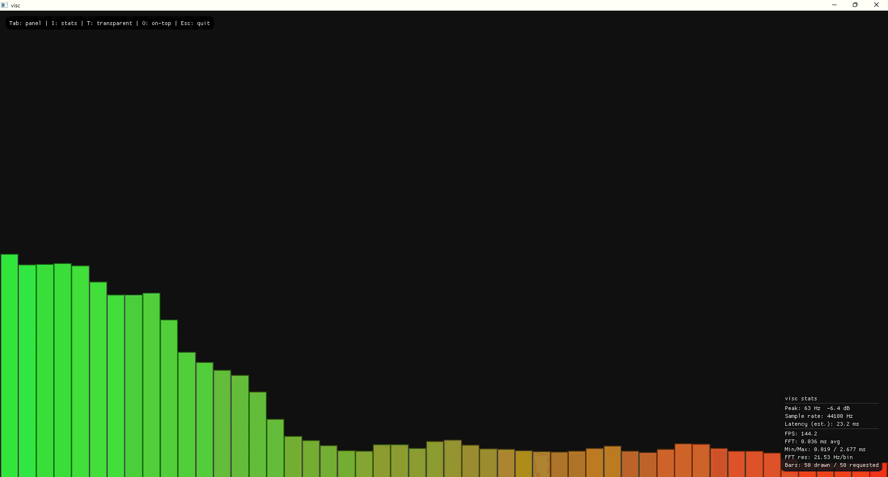

# visc — audio visualizer

Cross-platform audio visualizer written in C/C++ with SDL2, PortAudio, and Dear ImGui. Windows is the primary target; macOS and Linux should build with the same CMake flow.



## Features

- **Layouts:** vertical (default), horizontal, circular — hotkeys `1` / `2` / `3`
- **Modes:** spectrum (FFT) and waveform — hotkey `M` or UI combo
- **Audio input:** microphone/line-in, **desktop audio** (WASAPI loopback on Windows — captures what your speakers/DAC plays), or **MP3** file
- **Themes:** 10 built-in presets (Aurora, Sunset, Neon, Forest, …) — **[** / **]** to cycle; full sliders still under **Customize**
- **Transparent overlay:** bars only, desktop visible through empty areas (**T**)
- **Always on top:** float above other windows (**O**)
- **Animated backgrounds:** gradient shift, audio pulse, starfield, rainbow, beat flash (**G** to cycle)
- **Party mode:** auto-cycles themes (**P**)
- **Bar glow:** soft halo behind bars
- **Customization:** bar count, width, gap, colors/gradient, sensitivity, smoothing, frequency range, mirrored bars, rounded tops, peak hold, FPS cap
- **Settings UI:** in-app panel (Tab to toggle); save/load `.ini` presets via file dialogs
- **Window:** resizable

## Requirements

- CMake 3.16+
- C/C++ compiler (Visual Studio 2022 Build Tools, MSVC, MinGW, or Clang)
- Git (for FetchContent dependencies)
- Network on first configure (downloads SDL2, PortAudio, ImGui, and small vendor files)

## Build (Windows)

```powershell
cd visc
cmake -B build -DCMAKE_BUILD_TYPE=Release
cmake --build build --config Release
.\build\Release\visc.exe
```

Debug build:

```powershell
cmake --build build --config Debug
.\build\Debug\visc.exe
```

## Controls

| Key | Action |
|-----|--------|
| Tab | Show/hide settings panel |
| T | Toggle transparent overlay (see desktop behind bars) |
| O | Toggle always on top |
| G | Cycle animated background effect |
| P | Toggle party mode (auto theme cycling) |
| [ / ] | Previous / next built-in theme |
| 1 / 2 / 3 | Vertical / horizontal / circular layout |
| M | Toggle spectrum ↔ waveform |
| S | Quick-save `visc.ini` in the working directory |
| Esc | Quit |

Use the **settings** panel to pick a source:

1. **Desktop audio (speakers)** — choose your playback device (e.g. *Topping USB DAC*), click **Start desktop capture**, then play music in Windows with that device set as the default output.
2. **Microphone / line in** — for mics and physical inputs.
3. **MP3 file** — offline playback.

Tune sliders and save/load preset files as needed.

## Config files

Settings use a simple `key=value` format. See `visc.default.ini` for an example. The app auto-loads `visc.ini` from the current directory on startup if present.

## Project layout

```
src/          Application, audio, FFT, drawing, UI
vendor/       minimp3, kissfft, tinyfiledialogs (fetched at configure time)
CMakeLists.txt
```

## Notes

- MP3 playback loops the selected file.
- On Windows, **Desktop audio** uses WASAPI loopback on the selected playback device. Something must be playing audio (and the app using that output) or the capture stream stays quiet.
- Inspired by the audio visualizer software BeSpec
- WIP
